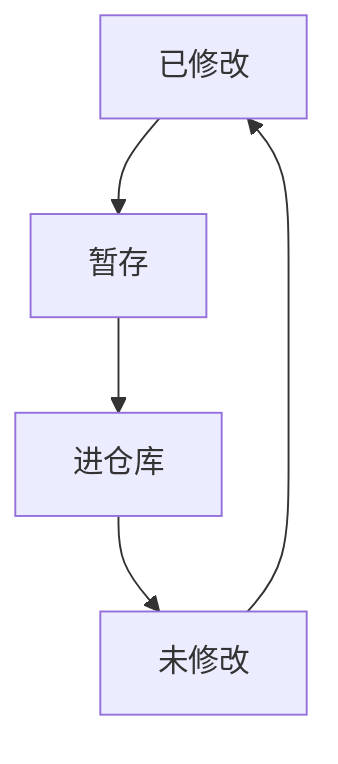

git：版本控制系统

# 配置

name 	

```powershell
git config --global user.name ''  ''
```

email

```powershell
git config --global user.email "  "
```


# 使用git

```powershell
--查看当前仓库的状态，是否是git管理
 git status
 
 --如果没有被git管理，那就初始化仓库
 git init
```


# 文件状态

git中的文件有两种状态：未跟踪 和 已跟踪。已跟踪的文件又有三种状态。

- 未跟踪：文件没有被git管理
- 已跟踪：文件已被git管理
  - 暂存：表示文件修改已经保存，但是尚未提交到git仓库
  - 未修改：表示磁盘中的文件 和 git仓库中的文件相同，没有修改
  - 已修改：表示磁盘中的文件已被修改，和git仓库中的文件不同

> 可以通过 git status  查看文件状态



刚添加到项目的文件是未追踪的:

- 未跟踪-----> 暂存

```powershell
git add .\	
```

- 暂存 -----> 进仓库（未修改）

```powershell
-m message
git commit -m "自己写提交改代码的信息"
```

- 未修改--->已修改（直接修改文件就会变更状态）
- 已修改 --->暂存

```powershell
git add .\	
```


add是变成 暂存 状态

commit 是变成 未修改 状态

**git commit -a -m ""  = add + commit (未跟踪的不会提交)**


# 常用命令

```bash
---恢复到最近一次提交,重置文件   取消commit
git restore <filename>
--- 取消文件的暂存状态    取消add
git restore --staged <filename>

--删除文件
--  -f 强制删除
git rm <filname>

--移动文件 重命名
git mv from to 
git mv 1.txt 2.txt
```


# 分支

git在存储文件时，每一次代码的提交都会创建一个与之对应的节点，git 就是通过一个一个的节点记录代码的状态。 

节点就构成树状的结构。树状结构意味着会存 在分支，默认情况下仓库只有一个分支，命名为master ，使用git时可以i创建多个分支，分支之间独立。

```bash
# 查看分支
git branch

#创建分支
git branch <branch name>

# 删除分支
git branch -d <branch name>

# 切换分支
git switch <branch name>

# 创建分支 并切换到该分支
git switch -c <branch name>
```


在开发中都是在自己的分支中编写代码，完成编写后，在将自己的分支和主分支合并：

- 方式一 merge：快速合并 fast-forward     和  手动合并

```bash
git switch master
git merge bug1
git branch -d bug1
```

- 方式二 变基 rebase：

通过merge合并分支的时候，在提交记录中会将所有的分支创建和分支合并的过程全部的显示出来，这样当项目比较复杂时，就需要反复的创建合并删除分支，这样一来，将会使得代码的提交记录很混乱

原理（变基时发生了什么）：

1. 当我们发起变基时，git会找到两条分支最近的共同祖先
2. 对比当前分支相对于祖先的历史提交，并且将他们的不同提取出来存储到临时文件
3. 将当前部分指向目标基底
4. 以当前基底开始，重新执行历史操作

```bash
git switch bug1
git rebase master
git switch master
git merge bug1
git branch -d bug1
```


变基和merge对于合并分支来说  最终的结果是一样的，但是变基会使得代码的提交记录更整洁，更清晰，建议更优先的用变基。

注意：大部分情况下，merge和变基是可以互换的，但是如果分支已经提交给远程仓库，那么这个时候尽量不要使用变基。在本地变完之后，在提交远程仓库。


# 远程仓库 remote

   以上的所有操作都是在本地进行操作的。但是在开发中显然是要和别人交互的，这时候就需要远程的git仓库，远程的git仓库和本地的仓库没有本质的区别。不同点在于远程的仓库可以被多个人访问，方便协同开发。在实际工作中，git的服务器通常由公司搭建，内部使用，或者购买公共的私有git服务器。学习阶段直接使用开放的公共git仓库。目前常用的库有两个：github  和 gitee

将本地库上传github:

```bash
#关联远程库
git remote add <remote name> <url>
#修改分支的名字为main，使用git的时候，默认分支为master,修改时为了 政治正确
# -m 修改
git branch -m main 

# 上传代码到服务器
# -u 表示和当前分支关联，关联以后git push 就可以上传代码
git push -u <remote name> <本地分支名>

git push <remote name> <本地分
支名>:<指定的 远程分支名>


```


## 远程库操作的命令

```bash
#列出当前关联的远程库
git remote

# 显示详细的信息
git remote -v

#删除远程库


# 下载代码
git clone <url> [分支名字]

#如果本地库的版本 低于远程库，也就是本地库和远程库的文件不同步，push默认是推不上去的。要想推送成功，必须确保本地库和远程库完全的同步（fetch）。
# fetch 他会从远程仓库下载所有的代码，但是不会将代码和当前分支自动合并
# 使用fetch拉取代码后，必须要手动的对代码进行合并
#push推送代码之前，要先去远程库拉取最新的代码

git fetch
git merge <remote name>/<本地分支>

# 从服务器拉取代码并自动合并 pull=fetch+merge
git pull
```


# tag 标签

- 当头指针没有指向某个分支的头部时候，这种状态称为 分离头指针 （head detached），在分离头指针的状态下也可以操作代码，但是这些操作不会出现在任何的分支上。所以注意不要在分离头指针的状态下操作仓库。
- 但是如果非得回到前面的节点对代码进行操作，可以选择 创建新的分支后操作

```bash
git switch -c <分支名> <节点id>
```


- 假如节点id太多，就很难找到想要的节点id，这个时候就希望给节点打上标签。设置标签以后，可以通过标签快速识别出不同的开发节点。

```bash
#打标签
git tag <v1.0>

#指定版本打标签
git tag <版本> 节点id

#显示标签
git tag

#切换到标签
git switch v1.0

#推送到远程仓库
git push <remote> v1.0

# 推送所有标签
git push <remote> --tags

#删除标签
git tag -d 标签名

#删除远程仓库的标签
git push <remote> --delete v1.0
```

code . 快速打开vscode


# gitignore

默认情况下，git会监视仓库目录，但是有的内容不希望被git所管理（比如编译器的配置文件），这个时候可以在项目目录中添加一个 .gitignore 文件来免去git监控。


# gh-pages

github提供了一个功能：可以部署 **静待网页** 到github。

github的静态页面

- 在github中可以将自己的静态页面部署，他会提供一个地址，使得我们的页面变成一个真正的网站，可以供用户访问

- 要求静待页面的分支必须叫做 gh-pages

- settings中有一个pages可以找到路径

- 如果希望页面可以通过username.github.io访问，则需要将库的名字配置为username.github.io

  

# docusaurus 开源静态网站搭建

meta推出的开源的静态的内容管理系统，官网 docusaurus.io